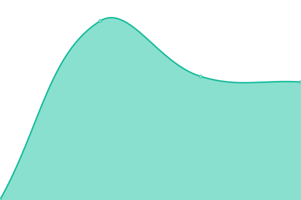
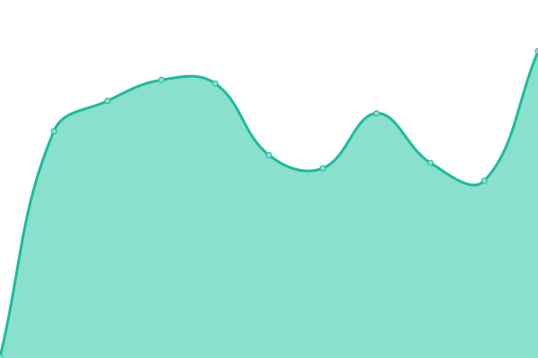

# [📈 Live Status](https://upptime.github.io/upptime): <!--live status--> **🟧 Partial outage**

This repository contains uptime monitors for a few of my projects. It is powered by [Upptime](https://github.com/upptime/upptime).

<!--start: status pages-->
<!-- This summary is generated by Upptime (https://github.com/upptime/upptime) -->
<!-- Do not edit this manually, your changes will be overwritten -->
<!-- prettier-ignore -->
| URL | Status | History | Response Time | Uptime |
| --- | ------ | ------- | ------------- | ------ |
|  [danielnemenyi.net](https://danielnemenyi.net) | 🟩 Up | [danielnemenyi-net.yml](https://github.com/danielnemenyi/upptime/commits/HEAD/history/danielnemenyi-net.yml) | 

 653ms
     
 | 

<a href="https://danielnemenyi.github.io/upptime/history/danielnemenyi-net">100.00%</a>
    

|  [radicalphilosophy.com](https://www.radicalphilosophy.com) | 🟩 Up | [radicalphilosophy-com.yml](https://github.com/danielnemenyi/upptime/commits/HEAD/history/radicalphilosophy-com.yml) | 

 942ms
     
 | 

<a href="https://danielnemenyi.github.io/upptime/history/radicalphilosophy-com">100.00%</a>
    

|  [okey.kompyuter.net](https://okey.kompyuter.net) | 🟩 Up | [okey-kompyuter-net.yml](https://github.com/danielnemenyi/upptime/commits/HEAD/history/okey-kompyuter-net.yml) | 

 434ms
     
 | 

<a href="https://danielnemenyi.github.io/upptime/history/okey-kompyuter-net">100.00%</a>
    

|  [Broken url](https://www.thissitedontwork999.com) | 🟥 Down | [broken-url.yml](https://github.com/danielnemenyi/upptime/commits/HEAD/history/broken-url.yml) | 

 0ms
     
 | 

<a href="https://danielnemenyi.github.io/upptime/history/broken-url">0.00%</a>
    

<!--end: status pages-->

## 📄 License

- Powered by: [Upptime](https://github.com/upptime/upptime)
- Code: [MIT](./LICENSE) © [Upptime](https://upptime.js.org)
- Data in the `./history` directory: [Open Database License](https://opendatacommons.org/licenses/odbl/1-0/)
